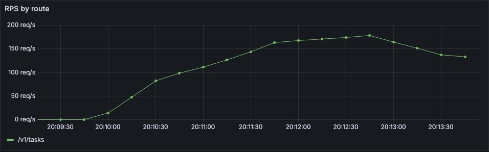
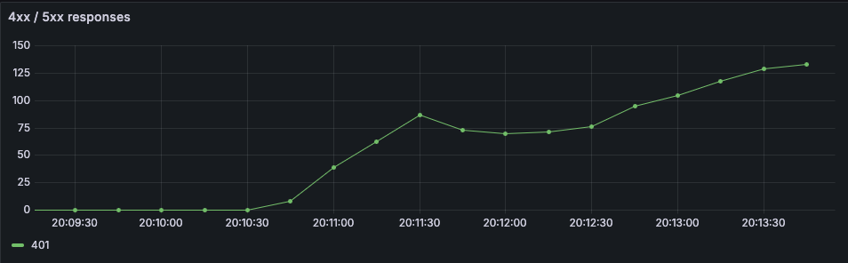
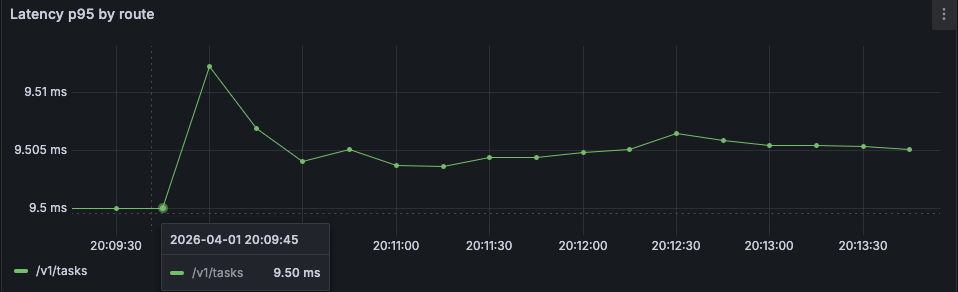

# Практическое занятие №4

## Рузин Иван Александрович ЭФМО-01-25

### Метрики приложения, Prometheus, Grafana и интеграция с HTTP сервисом

---

## 1. Краткое описание

В рамках работы реализована система сбора и визуализации метрик для сервиса **tasks**.

Добавлен endpoint `/metrics`, который экспортирует метрики в формате Prometheus.  
Собран стек мониторинга на базе **Prometheus + Grafana** через `docker-compose`.

Метрики позволяют отслеживать:

- количество запросов;
- ошибки;
- задержки;
- текущее число активных запросов.

---

## 2. Добавленные метрики

В сервисе реализованы три основные группы метрик.

### 2.1 Счётчик запросов

**http_requests_total** — counter

Labels:

- `method` — HTTP метод
- `route` — нормализованный маршрут
- `status` — HTTP статус

Используется для подсчёта общего количества запросов и анализа ошибок.

---

### 2.2 Длительность запросов

**http_request_duration_seconds** — histogram

Labels:

- `method`
- `route`

Bucket’ы:

```
0.01, 0.05, 0.1, 0.3, 1, 3
```

Используется для анализа latency и расчёта перцентилей (p95).

---

### 2.3 Активные запросы

**http_in_flight_requests** — gauge

Показывает текущее количество обрабатываемых запросов.

---

## 3. Реализация в коде

Метрики реализованы через middleware.

Что происходит при каждом запросе:

- увеличивается `in_flight`;
- замеряется время выполнения;
- после ответа:
    - уменьшается `in_flight`;
    - инкрементируется `requests_total`;
    - записывается длительность в histogram.

Также добавлен endpoint:

```
GET /metrics
```

---

## 4. Структура проекта

```

tip2_pr4/
├── services/
│   ├── auth/
│   └── tasks/
├── shared/
│   ├── metrics/
│   └── middleware/
├── deploy/
│   └── monitoring/
│       ├── docker-compose.yml
│       ├── prometheus.yml
│       └── grafana/
│           ├── provisioning/
│           └── dashboards/

```

---

## 5. Конфигурация мониторинга

### 5.1 Prometheus

Файл: `deploy/monitoring/prometheus.yml`

Основные параметры:

- `scrape_interval: 5s`
- target: `tasks:8082`

Prometheus периодически опрашивает `/metrics` у сервиса.

---

### 5.2 Docker Compose

В `deploy/monitoring/docker-compose.yml` поднимаются:

- auth service
- tasks service
- Prometheus
- Grafana

Все сервисы находятся в одной сети, что позволяет использовать имя контейнера для связи (`tasks:8082`).

---

### 5.3 Grafana

- Data Source: Prometheus
- Dashboard загружается автоматически через provisioning

Реализованы панели:

- RPS
- ошибки
- latency p95
- in-flight запросы

---

## 6. Пример вывода /metrics

```
curl -s http://localhost:8082/metrics | head -n 30
# HELP go_gc_duration_seconds A summary of the wall-time pause (stop-the-world) duration in garbage collection cycles.
# TYPE go_gc_duration_seconds summary
go_gc_duration_seconds{quantile="0"} 5.1624e-05
go_gc_duration_seconds{quantile="0.25"} 0.000215165
go_gc_duration_seconds{quantile="0.5"} 0.000404245
go_gc_duration_seconds{quantile="0.75"} 0.001028033
go_gc_duration_seconds{quantile="1"} 0.010846616
go_gc_duration_seconds_sum 0.268542123
go_gc_duration_seconds_count 305
# HELP go_gc_gogc_percent Heap size target percentage configured by the user, otherwise 100. This value is set by the GOGC environment variable, and the runtime/debug.SetGCPercent function. Sourced from /gc/gogc:percent.
# TYPE go_gc_gogc_percent gauge
go_gc_gogc_percent 100
# HELP go_gc_gomemlimit_bytes Go runtime memory limit configured by the user, otherwise math.MaxInt64. This value is set by the GOMEMLIMIT environment variable, and the runtime/debug.SetMemoryLimit function. Sourced from /gc/gomemlimit:bytes.
# TYPE go_gc_gomemlimit_bytes gauge
go_gc_gomemlimit_bytes 9.223372036854776e+18
# HELP go_goroutines Number of goroutines that currently exist.
# TYPE go_goroutines gauge
go_goroutines 14
# HELP go_info Information about the Go environment.
# TYPE go_info gauge
go_info{version="go1.26.1"} 1
# HELP go_memstats_alloc_bytes Number of bytes allocated in heap and currently in use. Equals to /memory/classes/heap/objects:bytes.
# TYPE go_memstats_alloc_bytes gauge
go_memstats_alloc_bytes 4.596e+06
# HELP go_memstats_alloc_bytes_total Total number of bytes allocated in heap until now, even if released already. Equals to /gc/heap/allocs:bytes.
# TYPE go_memstats_alloc_bytes_total counter
go_memstats_alloc_bytes_total 5.954594e+08
# HELP go_memstats_buck_hash_sys_bytes Number of bytes used by the profiling bucket hash table. Equals to /memory/classes/profiling/buckets:bytes.
# TYPE go_memstats_buck_hash_sys_bytes gauge
go_memstats_buck_hash_sys_bytes 1.44452e+06
````

---

## 7. Запуск проекта

### 7.1 Подготовка

```bash
go mod tidy
````

---

### 7.2 Запуск

```bash
cd deploy/monitoring
docker compose up --build -d
```

---

### 7.3 Проверка метрик

```bash
curl -s http://localhost:8082/metrics | head -n 30
```

---

### 7.4 Доступ к сервисам

* Tasks: [http://localhost:8082](http://localhost:8082)
* Prometheus: [http://localhost:9090](http://localhost:9090)
* Grafana: [http://localhost:3000](http://localhost:3000)

Логин для Grafana:

```
admin / admin
```

---

## 8. Генерация нагрузки

### Успешные запросы

```bash
for i in {1..5000}; do
  curl -s http://localhost:8082/v1/tasks \
    -H "Authorization: Bearer <TOKEN>" > /dev/null
done
```

---

### Ошибки

```bash
for i in {1..5000}; do
  curl -s http://localhost:8082/v1/tasks \
    -H "Authorization: Bearer wrong" > /dev/null
done
```

---

## 9. Grafana: построенные графики

### 9.1 RPS (запросы в секунду)

Запрос:

```
sum(rate(http_requests_total{route!="/metrics"}[1m])) by (route)
```



---

### 9.2 Ошибки (4xx / 5xx)

Запрос:

```
sum(rate(http_requests_total{route!="/metrics",status=~"4..|5.."}[1m])) by (status)
```



---

### 9.3 Latency p95

Запрос:

```
histogram_quantile(0.95,
  sum(rate(http_request_duration_seconds_bucket{route!="/metrics"}[5m])) by (le, route)
)
```



---

## 10. Ответы на контрольные вопросы

### Чем метрики отличаются от логов?

Метрики — агрегированные числовые показатели (удобны для мониторинга и алертов).
Логи — детализированные события (используются для отладки).

---

### Counter vs Gauge

* Counter — только увеличивается (например, количество запросов)
* Gauge — может увеличиваться и уменьшаться (например, активные запросы)

---

### Почему histogram для latency?

Histogram позволяет:

* считать перцентили (p95, p99)
* анализировать распределение значений

Среднее значение может скрывать пики.

---

### Что такое labels и почему опасна высокая кардинальность?

Labels — это измерения (method, route и т.д.).

Высокая кардинальность (например, уникальный id в route) приводит к:

* росту числа метрик
* увеличению нагрузки на Prometheus

---

### Зачем нужны p95/p99?

Перцентили показывают реальное поведение системы.

Среднее значение может быть низким, даже если часть запросов очень медленные.